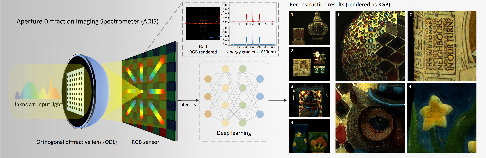

# ADIS
## Aperture Diffraction Imaging Spectrometer
### open source of "Compact Snapshot Spectral Imaging with Calibration-Free Aperture Diffraction".

This open-source repository primarily contains the following:

- ADIS forward simulation, incorporating various masks, utilised the open-source code ‘Diffractio’;
- Performance of Different Algorithms on ADIS Under a Unified Simulation Benchmark;
- 


## 1. System Configuration:



&nbsp;


## 2. Real Experiments:


&nbsp;


## 3. Create Environment:

- Python 3 (Recommend to use [Anaconda](https://www.anaconda.com/download/#linux))

- NVIDIA GPU + [CUDA](https://developer.nvidia.com/cuda-downloads)

- Python packages:

```shell
  pip install -r requirements.txt
```
