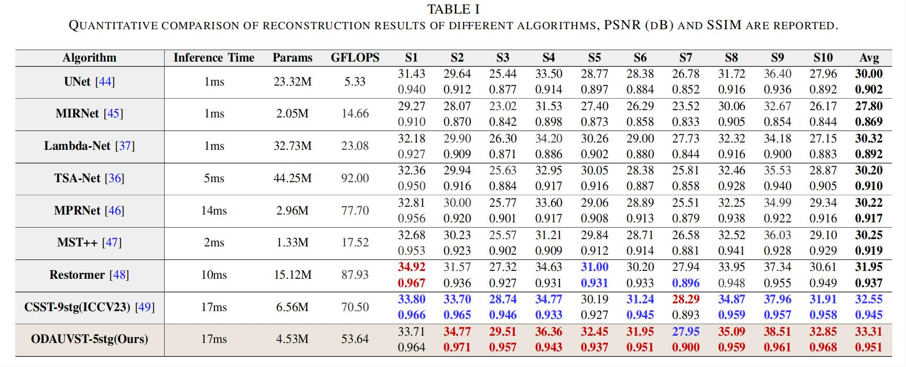

# ADIS
## Aperture Diffraction Imaging Spectrometer
### open source of "Compact Snapshot Spectral Imaging with Calibration-Free Aperture Diffraction".

This open-source repository primarily contains the following:

- ADIS forward simulation, incorporating various masks, utilised the open-source code ‘Diffractio’;
- Performance of Different Algorithms on ADIS Under a Unified Simulation Benchmark;
- 


## 1. System Configuration:


&nbsp;

## 2. Simulation Experiments:


&nbsp;


## 3. Real Experiments:


&nbsp;


## 4. Visualization:


&nbsp;


## 5. Create Environment:

- Python 3 (Recommend to use [Anaconda](https://www.anaconda.com/download/#linux))

- NVIDIA GPU + [CUDA](https://developer.nvidia.com/cuda-downloads)

- Python packages:

```shell
  pip install -r requirements.txt
```

## 6. Citation
If this repo helps you, please consider citing our works:


```shell
# ADIS+CSST ICCV 2023 Version
@inproceedings{lv2023aperture,
  title={Aperture Diffraction for Compact Snapshot Spectral Imaging},
  author={Lv, Tao and Ye, Hao and Yuan, Quan and Shi, Zhan and Wang, Yibo and Wang, Shuming and Cao, Xun},
  booktitle={Proceedings of the IEEE/CVF International Conference on Computer Vision},
  pages={10574--10584},
  year={2023}
}
# ADIS+ODAUVST IEEE TPAMI Version

```
